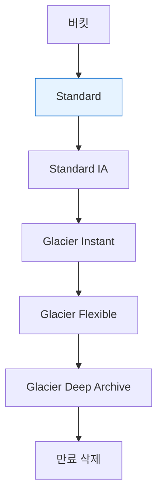

# 1. 개요

- **수명 규칙 Lifecycle rules** 은 S3 **버킷 bucket** 의 **객체 object** 를 시간 경과와 조건에 따라 **다른 스토리지 클래스로 전환 transition** 하거나 **삭제 expire** 하는 **자동 정책**입니다. 목적은 **비용 최적화**와 **데이터 보존 거버넌스**를 동시에 달성하는 것입니다.

# 2. 필요성 및 주요 장점

- **자동 비용 절감**: 사용 빈도가 낮아지는 데이터를 **IA 및 Glacier 계열**로 자동 이동.
- **보존 정책 준수**: 법적 보존 기간 종료 시점을 **자동 삭제**로 강제.
- **운영 단순화**: 스크립트 없이 **일관된 정책**을 모든 버킷에 적용.
- **버전 관리와 결합**: **이전 버전 noncurrent versions** 과 **삭제 마커 delete marker** 를 세밀하게 관리.
- **오브젝트 청소**: **미완성 멀티파트 업로드**를 자동 중단해 불필요 비용 방지.

# 3. 핵심 작동 원리

## 3-1. 수명 규칙 구성 요소

- **전환 행동 Transition actions**: 생성 후 N일 경과 시 다른 **스토리지 클래스 storage class** 로 이동.
    
    예) 30일 후 **Standard IA**, 180일 후 **Glacier Deep Archive**.
    
- **만료 행동 Expiration actions**: 생성 후 N일 시 **현재 버전** 삭제. 버전 관리가 켜져 있으면 **삭제 마커**가 생성됨.
- **이전 버전 규칙 Noncurrent rules**: 최신이 아닌 **이전 버전** 을 N일 후 다른 클래스 전환 또는 만료.
    - **Noncurrent days**: 이전 버전이 된 시점부터 계산.
    - **Newer noncurrent versions**: 최신에서 가까운 N개 이전 버전은 유지.
- **삭제 마커 수명**: 삭제 마커를 N일 후 제거 가능. 오랫동안 쌓이는 마커를 자동 정리.
- **미완성 멀티파트 업로드 중단**: 파트 업로드만 해 둔 **불완전 객체**를 N일 후 자동 중단해 저장 요금을 차단.
- **대상 선택 필터**: **프리픽스 prefix**, **태그 tag**(예: Department Finance), **객체 크기** 조건으로 범위를 제한.
- **우선순위**: 여러 규칙이 겹치면 **우선순위 priority** 가 낮은 값이 먼저 평가됩니다.

### 3-1-1. 전환 흐름 다이어그램

## 3-2. 평가 시점과 동작 특성

- **비동기**: 전환과 삭제는 백그라운드에서 수행되며, 일 단위 평가를 기준으로 처리됩니다.
- **최소 보관 기간 고려**: IA 30일, Glacier 계열 90일 Deep Archive 180일 등 **최소 보관 기간** 이전에 이동 또는 삭제하면 **조기 삭제 수수료**가 청구될 수 있습니다.
- **버전 관리 상호작용**
    - **현재 버전 만료**: 삭제 마커 생성.
    - **이전 버전 만료**: 실제 데이터 사본을 제거.
    - **객체 잠금 Object Lock** 또는 **보관 보존** 중이면 삭제 전환 **불가**.

## 3-3. 수명 규칙과 복제 연계

- **복제 대상 클래스 override** 와 **수명 규칙** 을 조합하면, DR 버킷을 **IA 또는 Glacier** 로 즉시 두고 이후 **Deep Archive** 로 전환하는 등 **2단계 비용 최적화** 가 가능합니다.
- **삭제 마커 복제** 정책과 충돌하지 않도록 문서화 필요.

# 4. 종류 및 비교

## 4-1. 전환 vs 만료

| 항목 | 전환 Transition | 만료 Expiration |
| --- | --- | --- |
| 목적 | 장기 데이터의 **저렴한 계층** 이동 | 보존 종료 시 **자동 삭제** |
| 적용 대상 | 현재 버전 이전 버전 모두 | 현재 버전 이전 버전 삭제 마커 |
| 주의점 | **최소 보관 기간** 과 **조회 요금** | **객체 잠금** 중이면 불가 |

## 4-2. 현재 버전 vs 이전 버전 관리

| 구분 | 현재 버전 | 이전 버전 Noncurrent |
| --- | --- | --- |
| 기준 시점 | 객체 **생성 시각** | **이전 버전이 된 시점** |
| 전환 예 | 60일 후 Standard IA | Noncurrent 30일 후 Glacier |
| 만료 예 | 365일 후 삭제 마커 | Noncurrent 180일 후 완전 삭제 |

# 5. 주요 구성 요소 및 기능

## 5-1. Storage Class Analysis S3 Analytics

- **목적**: 어떤 시점에 IA 로 옮길지 **데이터 기반 추천** 제공.
- **특성**
    - **Standard와 Standard IA** 에서 접근 패턴 분석을 지원. **One Zone IA 및 Glacier** 는 분석 대상 아님.
    - **일 단위 업데이트**. **24~48시간** 후부터 리포트 축적이 눈에 띔.
    - **CSV 보고서** 를 버킷으로 내보내며, 이를 근거로 **수명 규칙 개선** 가능.

## 5-2. 정책 설계 체크리스트

- **업무 보존 요건**: 법정 보존 기간과 삭제 시점을 문서화.
- **접근 패턴**: 읽기 빈도와 허용 지연을 수치화.
- **최소 보관 기간**: IA 30일, Glacier 90일, Deep Archive 180일을 고려해 임계값을 설정.
- **예외 경로**: 특정 프리픽스나 태그는 전환 제외.
- **버전 관리 전략**: 유지할 **이전 버전 개수** 와 **만료 시점** 을 분리해 정의.

# 6. 적합한 워크로드 Use Cases

- **이미지 원본 장기 보관**:
    - 업로드 후 60일은 **즉시 조회** 필요 → **Standard** 유지.
    - 60일 경과 후 **Glacier Flexible** 로 전환. 보고서는 **몇 시간 이내 복원 허용**을 전제로 설계.
- **썸네일 캐시 관리**:
    - 쉽게 재생성 가능 → **One Zone IA** 로 저장.
    - 60일 뒤 **만료 삭제**로 자동 정리.
- **삭제 후 복구 가능 정책**:
    - 30일 내 **즉시 복구 가능** 해야 함 → **Versioning 활성화**와 **현재 버전 만료 금지**.
    - 31~365일은 **48시간 내 복구 허용** → **이전 버전** 을 **Glacier Flexible** 로 전환 후 유지.
    - 365일 이후 **Deep Archive** 또는 완전 삭제.

# 7. 부적합한 워크로드 Bad Cases

- **항상 즉시 읽기** 가 필요한 핵심 데이터에 과도한 전환 설정.
- **최소 보관 기간보다 짧은 수명** 의 파일에 IA Glacier 전환 규칙 적용.
- **객체 잠금 또는 규정 준수 보존** 이 필요한 데이터에 자동 삭제 규칙 적용.
- **극소형 단기 객체** 에서 너무 공격적인 전환으로 오히려 요청 비용 증가.

# 8. 사용 모범 사례 및 주의점

- **Versioning 기본 ON** 후 설계: 현재 버전 삭제는 **삭제 마커**로 보호.
- **Noncurrent 중심의 비용 절감**: 이전 버전을 **빠르게 IA Glacier** 로 전환하고 **개수 제한** 설정.
- **Incomplete MPU 정리**: 7~14일 수준으로 **미완성 멀티파트 업로드 중단** 규칙을 추가.
- **태그 기반 규칙**: `DataClass=Archive` 같은 태그로 예외와 전환을 분리.
- **분석 선행**: **Storage Class Analysis** 로 전환 임계값을 수치화.
- **복제와 병행**: DR 버킷은 복제 시 **대상 클래스 override → Deep Archive 전환** 의 2단계 정책.
- **모니터링**: **S3 Storage Lens** 와 **CloudWatch 지표** 로 전환량, 만료량, 비용 추세를 추적.
- **변경 관리**: 규칙 수정은 **새 객체부터** 영향을 받는 항목이 있을 수 있으므로, **샘플 버킷에서 검증** 후 본 적용.

# 9. 요금 체계

- **저장 비용**: 전환 후에는 **대상 클래스 요율** 로 과금.
- **요청 비용**: 전환과 만료 처리에 수반되는 **요청 요금** 이 발생.
- **조회 복원 비용**: Glacier 계열로 전환된 데이터는 **조회 요금** 및 **복원 요금과 시간** 이 존재.
- **조기 삭제 수수료**: IA 30일, Glacier 90일, Deep Archive 180일 기준을 충족하지 못하면 부과.
- **분석 리포트**: 분석 결과 저장과 조회에 따른 **표준 S3 요금** 이 적용.

# 10. SAA 시험 포인트 요약

- **암기 포인트**
    1. **Transition vs Expiration** 을 구분하고, **Noncurrent 규칙** 은 **이전 버전 기준 시간** 임
    2. **IA 30일 Glacier 90일 Deep Archive 180일** 최소 보관 기간과 **조기 삭제 수수료**
    3. **미완성 멀티파트 업로드 중단** 규칙으로 파편 저장 비용 차단
    4. **Storage Class Analysis** 는 **Standard Standard IA** 에서 추천 제공
    5. **Versioning 켜진 버킷** 에서 **현재 버전 만료는 삭제 마커** 생성
    6. **Object Lock 보존 중** 인 객체는 전환 삭제 불가
    7. **태그 프리픽스 크기 조건** 으로 규칙 범위 제한 가능
    8. 복제와 결합 시 **대상 클래스 override** 로 DR 비용 최적화
- **자주 나오는 함정**
    - 최소 보관 기간을 무시하고 조기 삭제로 **예상 밖 비용** 발생
    - **이전 버전** 을 고려하지 않아 저장 비용이 눈덩이처럼 증가
    - **정책 겹침** 으로 의도치 않은 만료 발생 → **우선순위** 설정 누락
    - Glacier 전환 후 **복원 시간** 과 **복원 요금** 계획 부재
- **비교 한 줄 표**

| 항목 | 전환 규칙 | 만료 규칙 | 미완성 업로드 중단 |
| --- | --- | --- | --- |
| 목적 | 저렴한 계층 이동 | 보존 종료 자동 삭제 | 파편 비용 제거 |
| 기준 | 생성 시점 또는 이전 버전 시점 | 생성 시점 또는 삭제 마커 | 업로드 시작 후 N일 |
| 주의 | 최소 보관 기간 | 버전 관리와 상호작용 | 실수로 너무 짧게 설정 금지 |
- **한 줄 팁**
    - **Versioning ON + Noncurrent 전환과 만료 + Incomplete MPU 정리 + Storage Class Analysis 기반 임계값** 을 표준 템플릿으로 배포하면, **복구성 보장과 비용 최적화** 를 가장 안전하게 동시에 달성할 수 있습니다.